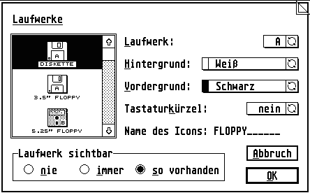

# The legendary GEM FlyDials library

As seen seen in [Gemini](https://github.com/gereons/gemini) - the true one, not that AI crap.

Started 1989. Last change 1997. No commit log, sorry.

And it comes with no warranties whatsoever. It might not even compile - if it does, let me know.

Enjoy.

(PC GEM support contributed by [Arnd Beißner](https://www.cappelino.de/company/arnd/) - RIP)